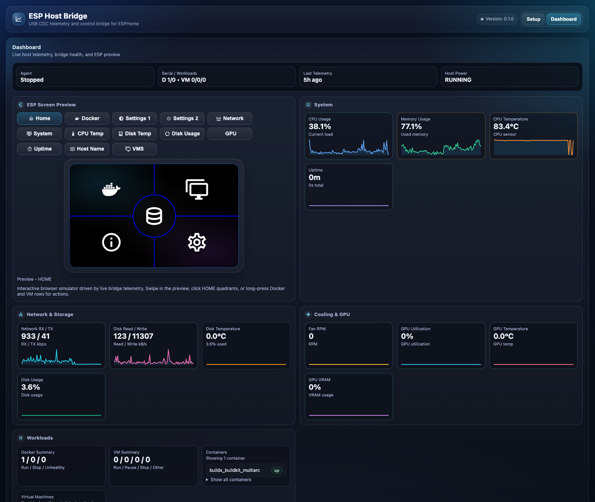
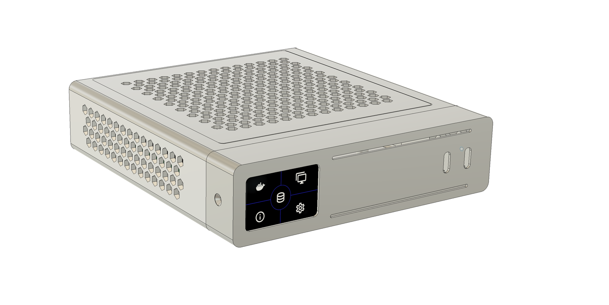
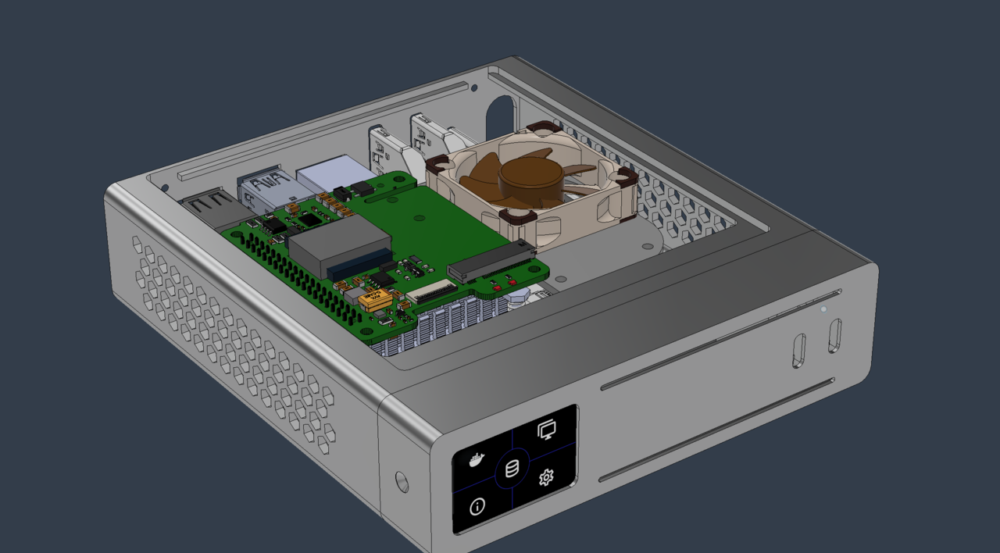
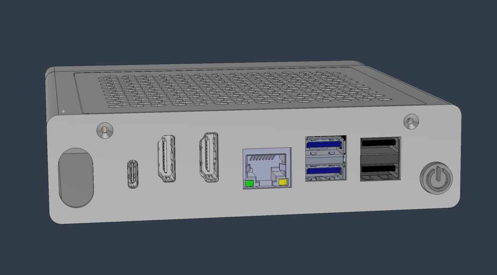
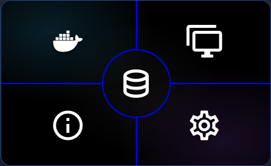
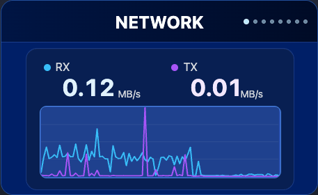
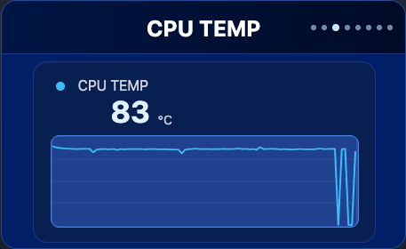

# ESP Host Bridge

ESP Host Bridge is a local Web UI and USB CDC agent for ESP display devices.

It runs on the host, reads local metrics, and sends compact updates to the ESP over serial.

## What it does

- local Web UI on port `8654`
- managed agent process
- USB CDC transport to the ESP device
- local host metrics such as CPU, memory, network, disk, and temperature
- optional Docker and VM polling
- optional direct Web UI password protection

## Web UI



## Also Available

If you want the Home Assistant add-on instead of the standalone Linux install, use:

- Home Assistant add-on: `https://github.com/rog713/ESP-Host-Bridge-Addon`

## Requirements

- Linux
- Python 3.9+
- a connected ESP device over USB serial

## Install

Clone the repository and install it from the project root:

```bash
git clone https://github.com/rog713/ESP-Host-Bridge.git
cd ESP-Host-Bridge
python3 -m pip install .
```

For Ubuntu bootstrap install:

```bash
curl -fsSL https://raw.githubusercontent.com/rog713/ESP-Host-Bridge/main/install-ubuntu.sh | sudo bash
```

Rerunning the installer on Ubuntu upgrades the files in place and restarts the service if it is already running.

To install into your home directory instead of `/opt/esp-host-bridge`:

```bash
curl -fsSL https://raw.githubusercontent.com/rog713/ESP-Host-Bridge/main/install-ubuntu.sh | \
  sudo ESP_HOST_BRIDGE_INSTALL_DIR=/home/$USER/esp-host-bridge ESP_HOST_BRIDGE_USER=$USER bash
```

## Run

Start the Web UI:

```bash
esp-host-bridge webui
```

Open:

- `http://127.0.0.1:8654`

## Basic use

1. Open the Web UI.
2. Select the serial port for the ESP device.
3. Save and start the agent.
4. Confirm metrics are updating.

## ESPHome

Unifi AI-Key inspired enclosure for Mini-PCs.







[MakerWorld model](https://makerworld.com/en/models/2575571-pi-key#profileId-2840040)

More models for other devices will be added on MakerWorld soon.

[Parts list for the enclosure build](docs/bom.md)

Example ESPHome display YAMLs live in `Esphome/`.

Currently included:

- `Esphome/host-key.yaml`  
  Reference firmware for the Waveshare ESP32-S3 Touch AMOLED 1.64 display module: `https://www.waveshare.com/esp32-s3-touch-amoled-1.64.htm?srsltid=AfmBOopppFyoRNGVg7sU9AVSuBIu3uMtdbn12-0CVSDJoOAEmXg8uDph`  
  It is intended for standalone ESP Host Bridge installs, connects to the host over USB CDC, and renders the full local telemetry UI on the display.

### Preview

HOME



NETWORK



CPU TEMP




## Notes

- The current UI and screensaver were reimplemented for this project rather than carried over from UniFi firmware. The design direction was informed by the original hardware/software aesthetic, but the ESPHome/LVGL implementation used here is specific to this project.
- The configuration file is created automatically on first run.
- The Web UI is the main way to manage settings.
- If you enable direct Web UI protection and forget the password, remove or edit the generated `config.json` and start again.
